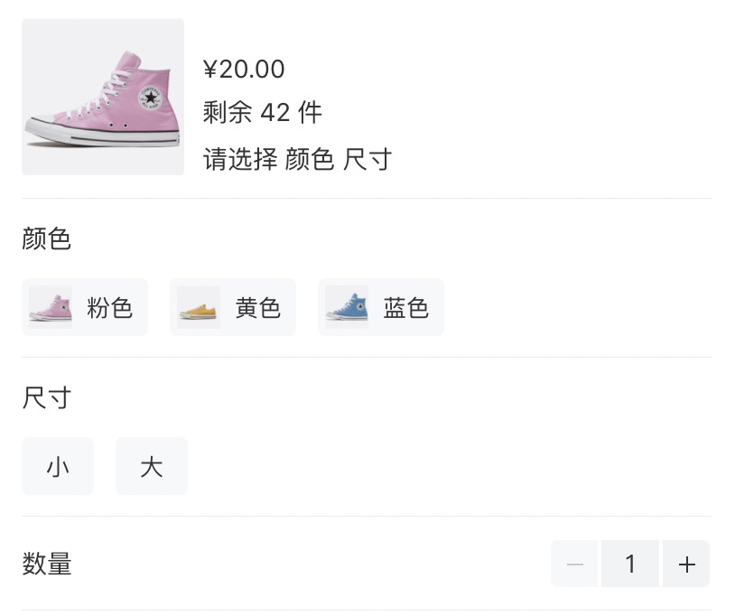

## 小程序 SKU 组件

项目依赖了 Vant Weapp 的 [Popup](https://vant-contrib.gitee.io/vant-weapp/#/popup)、[Stepper](https://vant-contrib.gitee.io/vant-weapp/#/stepper) 等组件和 [miniprogram-computed](https://developers.weixin.qq.com/miniprogram/dev/extended/utils/computed.html) 实现小程序 computed 计算属性

代码参考自 Vant 的 [SKU](https://youzan.github.io/vant/#/zh-CN/sku) 组件[源码](https://github.com/youzan/vant/tree/v2.10.12/src/sku)



## 运行

- 微信开发者工具导入代码

- 安装依赖 `npm i`

- 开发者工具中的菜单栏：`工具` -> `构建 npm`

## 代码示例

```html
<sku
  show="{{ showSku }}"
  sku-tree="{{ skuTree }}"
  sku-list="{{ skuList }}"
  picture="{{ skuPicture }}"
  price="{{ skuPrice }}"
  stock="{{ skuStock }}"
  bind:close="onCloseSku"
  bind:add-cart="onSkuAddCart"
  bind:buy="onSkuBuy"
/>
```

```js
Page({
  data: {
    showSku: true,
    skuTree: [
      // 数据结构见下方文档
    ],
    skuList: [
      // 数据结构见下方文档
    ],
    skuPicture: 'https://b.yzcdn.cn/vant/sku/shoes-1.png',
    skuPrice: 2000,
    skuStock: 20,
  },

  onCloseSku () {
    this.setData({ showSku: false })
  },

  /**
   * @desc 点击 sku 弹出层加入购物车
   * @param { Object } e.detail 选择的 sku 数据 { selectedCount, selectedSkuComb }
   */
  onSkuAddCart (e) {
    console.log(e)
  },

  /**
   * @desc 点击 sku 弹出层立即购买
   * @param { Object } e.detail 选择的 sku 数据 { selectedCount, selectedSkuComb }
   */
  onSkuBuy (e) {
    console.log(e)
  },
})
```

## API

### Props

| 参数 | 说明 | 类型 | 默认值 |
| --- | --- | --- | --- |
| show | 是否显示商品规格弹窗 | boolean | `false` |
| skuTree | 商品规格类目数据 | array | - |
| skuList | 商品 sku 组合列表 | array | - |
| picture | 默认商品 sku 缩略图 | string | - |
| price | 默认价格（单位分） | number | `0` |
| stock | 商品总库存 | number | `0` |

### Events

| 事件名 | 说明 | 回调参数 |
| --- | --- | --- |
| close | 点击关闭规格弹窗回调 | - |
| buy | 点击购买回调 | skuData: object |
| add-cart | 点击添加购物车回调 | skuData: object |

### sku 对象结构

```js
// 所有sku规格类目与其值的从属关系，比如商品有颜色和尺码两大类规格，颜色下面又有红色和蓝色两个规格值
// 可以理解为一个商品可以有多个规格类目，一个规格类目下可以有多个规格值
skuTree: [
  {
    k_s: 0, // skuKey: skuList 中当前类目对应的 key 值，value 值会是从属于当前类目的一个规格值
    name: '颜色', // skuKeyName 规格类目名称
    values: [
      { 
        name: '粉色', // skuValueName：规格值名称/id
        image: 'https://b.yzcdn.cn/vant/sku/shoes-1.png', // 规格类目图片
      },
      { 
        name: '黄色', 
        image: 'https://b.yzcdn.cn/vant/sku/shoes-2.png',
      },
      { 
        name: '蓝色', 
        image: 'https://b.yzcdn.cn/vant/sku/shoes-3.png',
      },
    ],
  },
  {
    k_s: 1,
    name: '尺寸',
    values: [
      { name: '小' },
      { name: '大' },
    ]
  }
]

// 所有 sku 的组合列表，比如粉色、大码为一个 sku 组合，黄色、小码为另一个组合
skuList: [
  {
    id: 2259, // skuId
    price: 2000, // 价格（单位分）
    stock: 20, // 当前 sku 组合对应的库存
    0: '粉色', // 规格类目 k_s 为 0 的对应规格值
    1: '大', // 规格类目 k_s 为 1 的对应规格值
  }
]
```

### 添加购物车和点击购买回调函数接收的 skuData 对象结构

```js
skuData: {
  // 选择的商品数量
  selectedCount: 1,
  // 选择的 sku 组合
  selectedSkuComb: {
    0: "粉色",
    1: "大",
    id: 2259,
    price: 2000,
    stock: 20,
  }
}
```